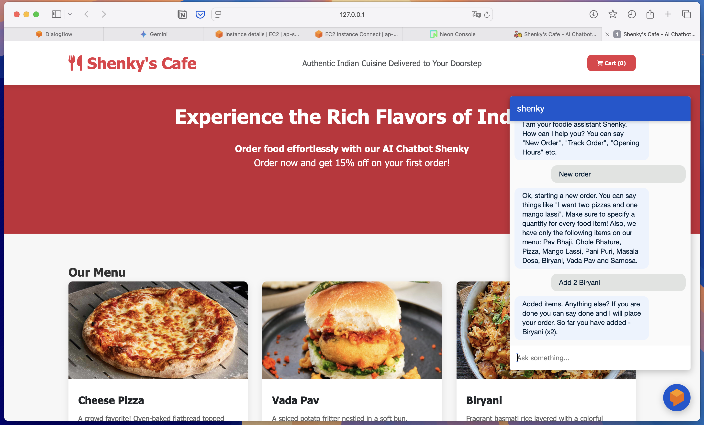
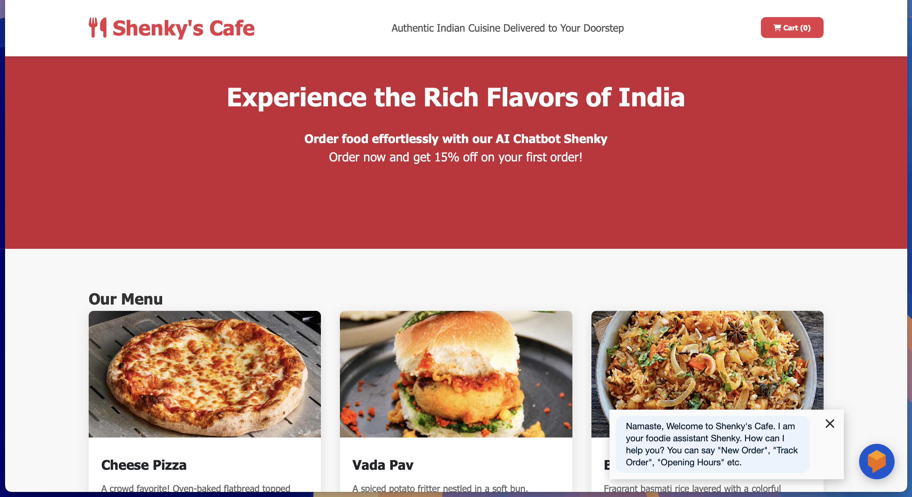

# Shenky - AI Chatbot for Food Ordering Platform

Shenky is an intelligent AI Chatbot designed specifically for food ordering platforms. It enhances customer experience by providing a conversational interface for browsing menus, placing orders, tracking deliveries, and handling customer inquiries.



## Features

- **Interactive Menu Browsing**: Users can view and explore the restaurant menu through natural conversation
- **Order Placement**: Take customer orders conversationally
- **Order Tracking**: Keep customers updated on their order status in real-time
- **FAQ Handling**: Answer common customer questions about opening hours, locations, and more
- **Responsive Web Interface**: Seamlessly integrated with the restaurant website

## Project Structure

The project consists of three main components:

1. **Website**: A responsive restaurant website that integrates the chatbot.
   

2. **Backend**: Python-based API server that handles order processing and business logic

   - Built with FastAPI for high-performance API endpoints

3. **Dialog Flow**: The conversational AI engine that powers Shenky
   - Trained with restaurant-specific phrases and scenarios
   - Handles natural language understanding and conversation management

## Technologies Used

- **Frontend**: HTML5, CSS3, JavaScript
- **Backend**: Python, FastAPI
- **AI/ML**: Google Dialogflow for NLP and conversation management
- **Deployment**: AWS is used for cloud infrastructure with EC2 for backend deployment and Amplify for website hosting.

## Getting Started

1. Clone this repository
2. Set up the backend:

```bash
cd backend
uv sync
uv run main.py
```

3. Open the website in your browser: this is an html file which you can directly open in any broweser.

## Future Roadmap

- Multi-language support
- Voice interface for hands-free ordering
- User Authentication and Payment Gateway Integration.

## About

You can access the website at [Shenky's Cafe](https://shenky-chatbot.shashankrajak.in)

Developed by [Shashank Rajak](https://shashankrajak.in) as a demonstration of AI-powered customer service for the restaurant industry.

For more information, visit:

- [Project Page](https://shashankrajak.in/projects/chatbot-shenky)
- [Blog Post](https://shashankrajak.in/blogs)
